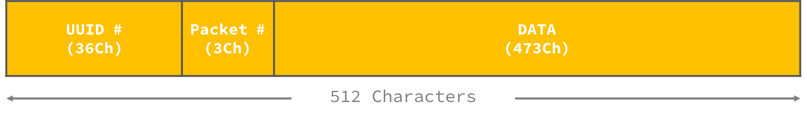

# TPAAnalog

## How to run:

- You need to run "networkLayer", using defined arguments:
    ```
    python networkLayer.py port maxNoPackets delay probDrop probMangle
    ```

- Then `Server.java` which by default listen to port 5001. To run the server on a different port pass it as an argument:
    ```
    javac Server.java 5001
    ```

- `Client.java` runs as the last file using three arguments for host, port and filename to read:
    ```
    javac Client.java localhost 5002 test.txt
    ```

## How Packets are structured:
- After reading the file, we are generating a Stack of Strings with this special padding:
    - All strings have a length of 512 characters.
    - The first 36 characters is a unique Java `UUID` which is used as a packet signature.
    - The next 3 characters determine the number of packets we are sending to the server. We use this to assert if we have sent all the unique packets from client to server.
    - The rest of String (473 characters) are filled with the data we have read from the file.
    - If we have some characters at the end of our file (less than 473 characters), we add enough characters to the end of it so we have another full packet.
    - We keep each packet as an string and push them into a `Stack`.
    <br>
    <br>
    

## TCP 3-Way Handshake:
- Client Side:
    - We push all the packets into a `Stakc<String>`.
    - Everytime, client sends one packet (from the top of our Stack) to Server as its `SYN`, then it chooses its next move based on the Server Response:
        - If Server `SYNACK` is a packet with less than 512 characters, client considers that as a "Corrupt Response", and it sends the packet again.
        - If client got a valie `SYNACK` from server, client will send the first 36 characters as `ACK` message.
            - Since client has sent this message successfully, the message will be moved to the bottom of Stack. Note that since the `ACK` message could fail itself, we should not remove the message from the Stack.
        - If client received a `END` message, it means the Server has got all the messages correctly, so client will `return`.

- Server Side:
    - Once server gets a `SYN` message from the client, it checks the basic packet structure in order to find out if it's a valid Packet.
        - A packet considered as Valid `SYN` if it has the correct number of characters (512) for each part of its structure and a valid `UUID`.
    - If server gets a valid Packet, it stores the packet in a temporary `HashMap<UUID, PACKET>` and sends a `SYNACK` to the client.
    - Once server gets a `ACK` message from the client, it checks `UUID` to make sure it has been stroed in its temporary `HashMap` and then stores the `Data` part of the packet in a `HashSet`, since the order of packets doesn't matter but they need to be unique (use a `LinkedHashSet` if order matters).
        - A message considered as Valid `ACK` if it has correct number of characters (36) and there is a key in our `HashMap` keeping its related Packet.
    - In every turn, server checks to see if it has all the packets. If it does, Server will repeatedly send a closing message `END` to client.
        - Note that number of packets is being sent as one part of our packet.

## Sample basic output
- using attached `text.txt` file and `5002 100 1 0 0` as `networkLayer` argument, `localhost 5002 test.txt` as `Client.java` argument and `5001` as `Server.java` argument:

Server:
```
Server is listening ...
Number of Packets: 8
ACK is transmitted for guid#: 2949ee60-8883-49b1-a361-4314492d8e39
ACK is transmitted for guid#: 2949ee60-8883-49b1-a361-4314492d8e39
ACK is transmitted for guid#: 2949ee60-8883-49b1-a361-4314492d8e39
ACK is transmitted for guid#: 2949ee60-8883-49b1-a361-4314492d8e39
Msg for GUID# 2949e has been stored on server successfully!
ACK is transmitted for guid#: eb02d25b-ac5b-4b68-b70b-6d63ec6fcbea
ACK is transmitted for guid#: f4e9bcba-50e0-4738-b8d6-4833e5381689
ACK is transmitted for guid#: cde1d50a-9ee5-43d7-a9be-68e8771245a4
Msg for GUID# eb02d has been stored on server successfully!
ACK is transmitted for guid#: 3118b957-ee24-450f-b9f7-b07eab664d60
Msg for GUID# f4e9b has been stored on server successfully!
ACK is transmitted for guid#: fa7ff776-0f10-440b-90f9-0737185525b1
Msg for GUID# cde1d has been stored on server successfully!
ACK is transmitted for guid#: 1b54789d-df24-4a6d-a1b5-240f0327ffd2
Msg for GUID# 3118b has been stored on server successfully!
ACK is transmitted for guid#: a04a248a-6834-468e-8450-6c4a39cf2488
Msg for GUID# fa7ff has been stored on server successfully!
ACK is transmitted for guid#: 2949ee60-8883-49b1-a361-4314492d8e39
Msg for GUID# 1b547 has been stored on server successfully!
ACK is transmitted for guid#: eb02d25b-ac5b-4b68-b70b-6d63ec6fcbea
Msg for GUID# a04a2 has been stored on server successfully!
ACK is transmitted for guid#: f4e9bcba-50e0-4738-b8d6-4833e5381689
Msg for GUID# 2949e has been stored on server successfully!
ACK is transmitted for guid#: cde1d50a-9ee5-43d7-a9be-68e8771245a4
Msg for GUID# eb02d has been stored on server successfully!
```

Client:
```
Timeout! Retransmitting...
Got a Valid Message by Server: 2949e
	 send back the acknowledgement for quid: 2949e
Got a Valid Message by Server: 2949e
	 send back the acknowledgement for quid: 2949e
Got a Valid Message by Server: 2949e
	 send back the acknowledgement for quid: 2949e
Got a Valid Message by Server: eb02d
	 send back the acknowledgement for quid: eb02d
Got a Valid Message by Server: f4e9b
	 send back the acknowledgement for quid: f4e9b
Got a Valid Message by Server: cde1d
	 send back the acknowledgement for quid: cde1d
Got a Valid Message by Server: 3118b
	 send back the acknowledgement for quid: 3118b
Got a Valid Message by Server: fa7ff
	 send back the acknowledgement for quid: fa7ff
Got a Valid Message by Server: 1b547
	 send back the acknowledgement for quid: 1b547
Got a Valid Message by Server: a04a2
	 send back the acknowledgement for quid: a04a2
Got a Valid Message by Server: 2949e
	 send back the acknowledgement for quid: 2949e
Got a Valid Message by Server: eb02d
	 send back the acknowledgement for quid: eb02d
---------------------------
SERVER GOT ALL THE MESSAGES
---------------------------
```

## Output with Mangled/Dropped packets:
- using attached `text.txt` file and `5002 100 1 5 5` as `networkLayer` argument, `localhost 5002 test.txt` as `Client.java` argument and `5001` as `Server.java` argument:

Server:
```
Server is listening ...
Number of Packets: 8
ACK is transmitted for guid#: 370a051b-2473-4631-ac3e-9ffb69a42da5
ACK is transmitted for guid#: 370a051b-2473-4631-ac3e-9ffb69a42da5
Server has received a corrupted msg! : 513
ACK is transmitted for guid#: 370a051b-2473-4631-ac3e-9ffb69a42da5
ACK is transmitted for guid#: 370a051b-2473-4631-ac3e-9ffb69a42da5
ACK is transmitted for guid#: 370a051b-2473-4631-ac3e-9ffb69a42da5
Msg for GUID# 370a0 has been stored on server successfully!
ACK is transmitted for guid#: ef91747f-5278-4ea7-8278-cb987f71e18e
ACK is transmitted for guid#: 80cbf33d-7094-4e93-88c0-e45e3f4a4653
ACK is transmitted for guid#: 442bc9cd-d481-4345-90dd-d86b1aeff2fc
Msg for GUID# ef917 has been stored on server successfully!
ACK is transmitted for guid#: 95ca0423-c9f4-4aba-b43d-a035b447c75c
Msg for GUID# 80cbf has been stored on server successfully!
ACK is transmitted for guid#: 0cd93aba-481e-4233-afb3-b6f44ef26704
Server has received a corrupted msg! : 513
ACK is transmitted for guid#: 0cd93aba-481e-4233-afb3-b6f44ef26704
ACK is transmitted for guid#: 0cd93aba-481e-4233-afb3-b6f44ef26704
ACK is transmitted for guid#: 0cd93aba-481e-4233-afb3-b6f44ef26704
Msg for GUID# 0cd93 has been stored on server successfully!
ACK is transmitted for guid#: 58b17d86-8a87-4bf2-854b-da524e9fcdb9
ACK is transmitted for guid#: 58b17d86-8a87-4bf2-854b-da524e9fcdb9
ACK is transmitted for guid#: 58b17d86-8a87-4bf2-854b-da524e9fcdb9
Msg for GUID# 58b17 has been stored on server successfully!
ACK is transmitted for guid#: 1f24e60b-a004-4122-8a65-56e3c75e0966
ACK is transmitted for guid#: 370a051b-2473-4631-ac3e-9ffb69a42da5
ACK is transmitted for guid#: ef91747f-5278-4ea7-8278-cb987f71e18e
Msg for GUID# 1f24e has been stored on server successfully!
ACK is transmitted for guid#: 80cbf33d-7094-4e93-88c0-e45e3f4a4653
Msg for GUID# 370a0 has been stored on server successfully!
ACK is transmitted for guid#: 442bc9cd-d481-4345-90dd-d86b1aeff2fc
Msg for GUID# ef917 has been stored on server successfully!
ACK is transmitted for guid#: 95ca0423-c9f4-4aba-b43d-a035b447c75c
Guid is mangled by server : 0)d 3aba-481e-4233-afb3-b6f44ef26704
Msg for GUID# 442bc has been stored on server successfully!
ACK is transmitted for guid#: 58b17d86-8a87-4bf2-854b-da524e9fcdb9
ACK is transmitted for guid#: 58b17d86-8a87-4bf2-854b-da524e9fcdb9
ACK is transmitted for guid#: 58b17d86-8a87-4bf2-854b-da524e9fcdb9
Msg for GUID# 58b17 has been stored on server successfully!
ACK is transmitted for guid#: 1f24e60b-a004-4122-8a65-56e3c75e0966
ACK is transmitted for guid#: 370a051b-2473-4631-ac3e-9ffb69a42da5
Server has received a corrupted msg! : 550
ACK is transmitted for guid#: 80cbf33d-7094-4e93-88c0-e45e3f4a4653
ACK is transmitted for guid#: 80cbf33d-7094-4e93-88c0-e45e3f4a4653
Server has received a corrupted msg! : 550
ACK is transmitted for guid#: 442bc9cd-d481-4345-90dd-d86b1aeff2fc
ACK is transmitted for guid#: 442bc9cd-d481-4345-90dd-d86b1aeff2fc
ACK is transmitted for guid#: 442bc9cd-d481-4345-90dd-d86b1aeff2fc
Msg for GUID# 442bc has been stored on server successfully!
ACK is transmitted for guid#: 95ca0423-c9f4-4aba-b43d-a035b447c75c
ACK is transmitted for guid#: 0cd93aba-481e-4233-afb3-b6f44ef26704
ACK is transmitted for guid#: 58b17d86-8a87-4bf2-854b-da524e9fcdb9
Msg for GUID# 95ca0 has been stored on server successfully!
ACK is transmitted for guid#: 1f24e60b-a004-4122-8a65-56e3c75e0966
Msg for GUID# 0cd93 has been stored on server successfully!
ACK is transmitted for guid#: 370a051b-2473-4631-ac3e-9ffb69a42da5
Msg for GUID# 58b17 has been stored on server successfully!
Server has received a corrupted msg! : 53
```

Client:
```
Timeout! Retransmitting...
Timeout! Retransmitting...
Timeout! Retransmitting...
Timeout! Retransmitting...
Got a corrupt ACK from Server - len: 1
Got a Valid Message by Server: 370a0
	 send back the acknowledgement for quid: 370a0
Got a Valid Message by Server: 370a0
	 send back the acknowledgement for quid: 370a0
Got a Valid Message by Server: 370a0
	 send back the acknowledgement for quid: 370a0
Got a Valid Message by Server: ef917
	 send back the acknowledgement for quid: ef917
Got a Valid Message by Server: 80cbf
	 send back the acknowledgement for quid: 80cbf
Timeout! Retransmitting...
Got a corrupt ACK from Server - len: 8
Timeout! Retransmitting...
Timeout! Retransmitting...
Got a corrupt ACK from Server - len: 9
Got a Valid Message by Server: 0cd93
	 send back the acknowledgement for quid: 0cd93
Timeout! Retransmitting...
Got a corrupt ACK from Server - len: 12
Got a Valid Message by Server: 58b17
	 send back the acknowledgement for quid: 58b17
Got a Valid Message by Server: 58b17
	 send back the acknowledgement for quid: 58b17
Got a Valid Message by Server: 58b17
	 send back the acknowledgement for quid: 58b17
Got a Valid Message by Server: 1f24e
	 send back the acknowledgement for quid: 1f24e
Got a Valid Message by Server: 370a0
	 send back the acknowledgement for quid: 370a0
Got a Valid Message by Server: ef917
	 send back the acknowledgement for quid: ef917
Got a Valid Message by Server: 80cbf
	 send back the acknowledgement for quid: 80cbf
Got a Valid Message by Server: 442bc
	 send back the acknowledgement for quid: 442bc
Timeout! Retransmitting...
Got a corrupt ACK from Server - len: 21
Got a Valid Message by Server: 58b17
	 send back the acknowledgement for quid: 58b17
Got a Valid Message by Server: 58b17
	 send back the acknowledgement for quid: 58b17
Got a Valid Message by Server: 58b17
	 send back the acknowledgement for quid: 58b17
Got a Valid Message by Server: 1f24e
	 send back the acknowledgement for quid: 1f24e
Timeout! Retransmitting...
Timeout! Retransmitting...
Got a corrupt ACK from Server - len: 26
Got a Valid Message by Server: 80cbf
	 send back the acknowledgement for quid: 80cbf
Timeout! Retransmitting...
Timeout! Retransmitting...
Got a corrupt ACK from Server - len: 28
Got a Valid Message by Server: 442bc
	 send back the acknowledgement for quid: 442bc
Got a Valid Message by Server: 442bc
	 send back the acknowledgement for quid: 442bc
Got a Valid Message by Server: 442bc
	 send back the acknowledgement for quid: 442bc
Got a Valid Message by Server: 95ca0
	 send back the acknowledgement for quid: 95ca0
Got a Valid Message by Server: 0cd93
	 send back the acknowledgement for quid: 0cd93
Got a Valid Message by Server: 58b17
	 send back the acknowledgement for quid: 58b17
---------------------------
SERVER GOT ALL THE MESSAGES
---------------------------
```